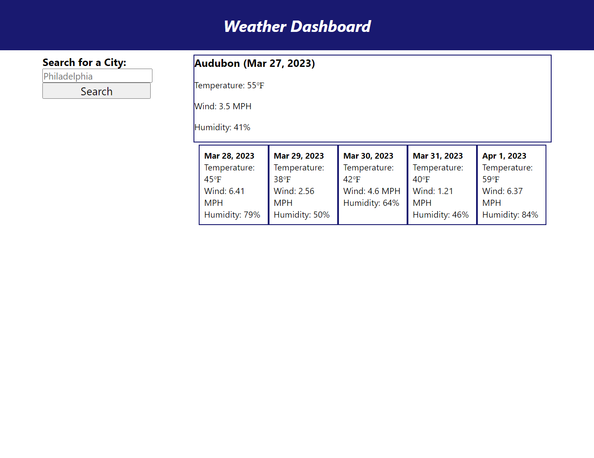

# Weather Dash

## Description

[Click this link to access the website](https://greg-pfeifer.github.io/weather_dash/)

This project was completed for the purpose of creating a weather application that generates current weather conditions based on the user's location. It also generates a 5-day forecast for the user's current location. The user can type in a city name in the search bar and the dashboard will respond with the current weather conditions and 5-day forecast for that location.  

This was good practice for navigating the data returned by an API. In the future, I plan on cleaning up the styling, removing all "duplicated" code and referencing the indixes with a variable, and adding the search button history feature.  

## Usage

Screenshot of deployed application

## License

Please refer to the repository to find a copy of the license.